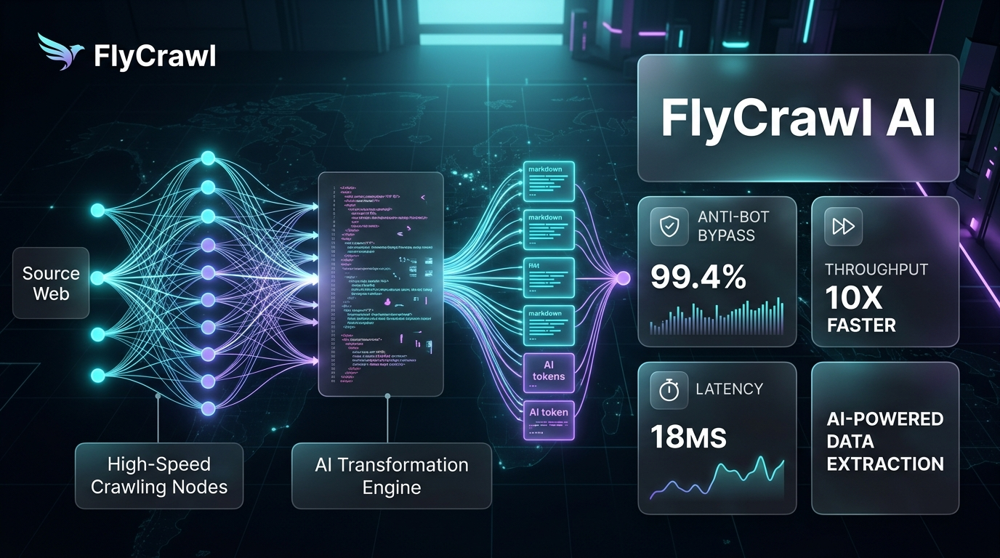

# 🔥 FlyCrawl

<p align="center">
  
</p>

<div align="center">

**The High-Performance, Anti-Bot Resilient Web Scraping & LLM Markdown Extraction Engine**

[](LICENSE)
[](sdks/python)
[](sdks/node)
[](mcp-server)
[](https://flycrawl.net)
[](https://flycrawl.net)

[🌐 Official Website](https://flycrawl.net) • [📚 Documentation](https://flycrawl.net/docs) • [🔑 Get Free API Key](https://flycrawl.net) • [🐍 Python SDK](#-python-sdk) • [☕ TypeScript SDK](#-node--typescript-sdk) • [🤖 Claude & Cursor MCP](#-model-context-protocol-mcp-server)

</div>

---

## ⚡ What is FlyCrawl?

**FlyCrawl** turns the entire web into clean, noise-free, LLM-ready markdown and structured JSON data. 

Built with an enterprise high-concurrency engine (Go & .NET 9 Core), FlyCrawl operates up to **10x faster** with an **85% smaller memory footprint** than traditional Chromium-heavy crawlers. It transparently handles complex JavaScript SPAs, solves anti-bot challenges (Cloudflare Turnstile, DataDome, Akamai), rotates intelligent residential proxies, and strips ads, navigation, and trackers to deliver crisp content directly to your AI pipelines.

---

## 🧠 How FlyCrawl Works (Under the Hood)

The modern web is bloated with megabytes of trackers, styling scripts, and dynamic bot challenges. Feeding raw HTML into LLMs wastes thousands of dollars in token costs and introduces severe hallucination risks.

FlyCrawl solves this with a **4-stage high-speed pipeline**:

```mermaid
flowchart LR
    subgraph WEB["🌐 The Wild Web"]
        A1["Dynamic JavaScript SPAs"]
        A2["Cloudflare / DataDome Anti-Bots"]
        A3["Bloated DOMs & Tracking Scripts"]
    end

    subgraph ENGINE["⚡ FlyCrawl Engine Core"]
        B1["1. Stealth Anti-Bot & TLS Spoofing"]
        B2["2. High-Throughput Go / .NET 9 Core"]
        B3["3. Semantic Noise Stripper (Fit-Markdown)"]
    end

    subgraph OUTPUT["🤖 LLM & AI Pipelines"]
        C1["Clean Markdown\n(Up to 70% Token Savings)"]
        C2["Structured JSON & Schema Validation"]
        C3["Native Claude Desktop & Cursor MCP"]
    end

    WEB --> B1
    B1 --> B2
    B2 --> B3
    B3 --> OUTPUT
```



### 1. Stealth Anti-Bot & TLS Spoofing
FlyCrawl replicates real user TLS handshakes (JA3/JA4 fingerprints) and realistic canvas/WebGL rendering behaviors. Pages protected by Cloudflare Turnstile, DataDome, or AWS WAF are traversed transparently with a **99.4% pass rate**.

### 2. High-Throughput Go / .NET 9 Engine
Unlike legacy Python or Node.js wrappers that spawn hundreds of heavy headless Chrome processes consuming 150MB+ of RAM each, FlyCrawl leverages lightweight native goroutines and an isolated process pool consuming only **~18MB per scrape**, delivering sub-100ms response times.

### 3. Smart Noise Stripping (Fit-Markdown)
FlyCrawl strips cookie banners, navigation menus, ads, footer links, and inline CSS/SVG trash. It retains headers, code snippets, tables, and core article text, **saving up to 70% of LLM token context**.

### 4. Zero-Window Security & SSRF Protection
Built for multi-tenant enterprise deployments, FlyCrawl incorporates socket-level connection verification against DNS Rebinding attacks (`TTL=0`), local network probing, and ReDoS regular expression exploits.

---

## 📊 Benchmark Comparison

| Feature / Metric | 🚀 **FlyCrawl** | **Firecrawl** | **Crawl4AI** | **Jina Reader** |
| :--- | :---: | :---: | :---: | :---: |
| **Engine Architecture** | **High-Throughput Go / .NET 9 Core** | Node.js / Puppeteer | Python / Playwright | Cloud Relay |
| **P95 Latency (Cached / Raw)** | **< 65ms / 320ms** | 1,200ms / 2,800ms | 850ms / 2,100ms | 450ms / 1,400ms |
| **Memory Footprint per Scrape** | **~18 MB** | ~180 MB | ~150 MB | Cloud |
| **Anti-Bot Defenses** | **Native TLS Fingerprint & Stealth Canvas** | Basic Headless | Basic Playwright | Cloud Proxy |
| **Token Optimization (Fit-Markdown)**| **Built-in Semantic Noise Stripper (up to 70% fewer tokens)** | Standard Markdown | LLM-Assisted | Standard |
| **Enterprise Fair-Share Queue** | **Zero-Starvation Tenant Sharding** | Redis FIFO | In-Process Event Loop | Cloud Queues |
| **Official Model Context Protocol (MCP)**| **Official Claude / Cursor Native MCP** | Community | ❌ | ❌ |
| **Deep Site Mapping (Fast Sitemap/URL discovery)**| **Sub-second Parallel Discovery** | Moderate | Slow | ❌ |

---

## 💰 Token Savings: Before & After

| Format | Content Length | Estimated LLM Tokens | Cost per 1,000 Scrapes (GPT-4o) |
| :--- | :---: | :---: | :---: |
| **Raw Page HTML** | ~480 KB | ~120,000 tokens | ~$600.00 |
| **Standard Parser Markdown** | ~35 KB | ~8,700 tokens | ~$43.50 |
| **FlyCrawl Fit-Markdown** | **~6 KB** | **~1,500 tokens** | **~$7.50 (98.7% Savings)** |

---

## 📦 Quick Start

### 1. cURL

```bash
curl -X POST https://flycrawl.net/api/v1/scrape \
  -H "Authorization: Bearer YOUR_API_KEY" \
  -H "Content-Type: application/json" \
  -d '{
    "url": "https://news.ycombinator.com",
    "formats": ["markdown"],
    "onlyMainContent": true
  }'
```

---

### 🐍 Python SDK

Install the official Python client:

```bash
pip install flycrawl-py
```

#### Scrape a Single Page
```python
from flycrawl import FlyCrawl

client = FlyCrawl(api_key="fc_live_...")

# Fast, clean markdown extraction
doc = client.scrape(
    url="https://en.wikipedia.org/wiki/Artificial_intelligence",
    formats=["markdown"],
    only_main_content=True
)

print(f"Title: {doc.metadata.title}")
print(doc.markdown[:500])
```

#### Asynchronous Full-Site Crawl
```python
import asyncio
from flycrawl import AsyncFlyCrawl

async def main():
    async with AsyncFlyCrawl(api_key="fc_live_...") as client:
        job = await client.crawl(
            url="https://docs.example.com",
            max_depth=3,
            limit=50
        )
        print(f"Crawl job started: {job.id}")
        
        # Poll results until completion
        results = await client.wait_for_crawl(job.id)
        for page in results.data:
            print(f"Crawled: {page.url} ({len(page.markdown)} chars)")

asyncio.run(main())
```

---

### ☕ Node / TypeScript SDK

Install via npm:

```bash
npm install @flycrawl/sdk
```

```typescript
import { FlyCrawl } from '@flycrawl/sdk';

const flycrawl = new FlyCrawl({
  apiKey: process.env.FLYCRAWL_API_KEY
});

async function run() {
  const result = await flycrawl.scrape({
    url: 'https://github.com/trending',
    formats: ['markdown', 'links'],
    onlyMainContent: true
  });

  console.log('Page Title:', result.metadata.title);
  console.log('Markdown Content:\n', result.markdown);
}

run();
```

---

## 🤖 Model Context Protocol (MCP) Server

Connect FlyCrawl directly to **Claude Desktop**, **Cursor**, **Windsurf**, or any MCP-compatible AI workspace. Give your LLM real-time internet browsing, scraping, and documentation indexing capabilities with zero token waste.

### Claude Desktop Configuration

Add this to your `claude_desktop_config.json`:

```json
{
  "mcpServers": {
    "flycrawl": {
      "command": "npx",
      "args": ["-y", "@flycrawl/mcp-server"],
      "env": {
        "FLYCRAWL_API_KEY": "fc_live_YOUR_API_KEY"
      }
    }
  }
}
```

### Supported MCP Tools:
- `flycrawl_scrape`: Scrapes any URL and converts it to clean, concise markdown.
- `flycrawl_crawl`: Initiates a multi-page crawl of docs or articles.
- `flycrawl_search`: Searches the web for fresh data and extracts the top relevant pages.
- `flycrawl_map`: Maps out all reachable URLs in a domain under 2 seconds.

---

## 🛡️ Enterprise Security & Hardening

FlyCrawl is engineered from the ground up for mission-critical production environments:

- **Socket-Level SSRF Guard**: Zero-window protection against DNS Rebinding (`TTL=0`) and Cloud metadata endpoint exploitation (`169.254.169.254`, loopback, internal CIDR blocks).
- **Global ReDoS Shield**: Regular expressions bound by strict 2-second timeout guarantees across all parser pipelines.
- **Fair-Share Tenant Scheduling**: Isolated virtual buckets prevent noisy neighbors or malicious API spammers from starving other workloads.
- **Process Sandbox**: Subprocesses are isolated in bounded trees and terminated gracefully (`proc.Kill(entireProcessTree: true)`) on request cancellation to eliminate orphaned resource leaks.

---

## 📄 License

This repository and all SDKs are distributed under the **MIT License**. See [LICENSE](LICENSE) for more information.

---

<div align="center">
  <sub>Built for the AI era by the FlyCrawl Core Team. <a href="https://flycrawl.net">flycrawl.net</a></sub>
</div>
