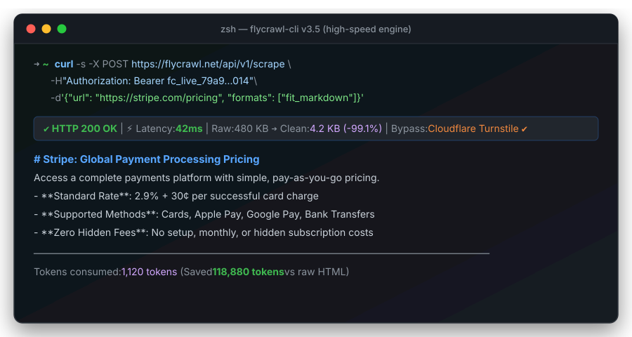
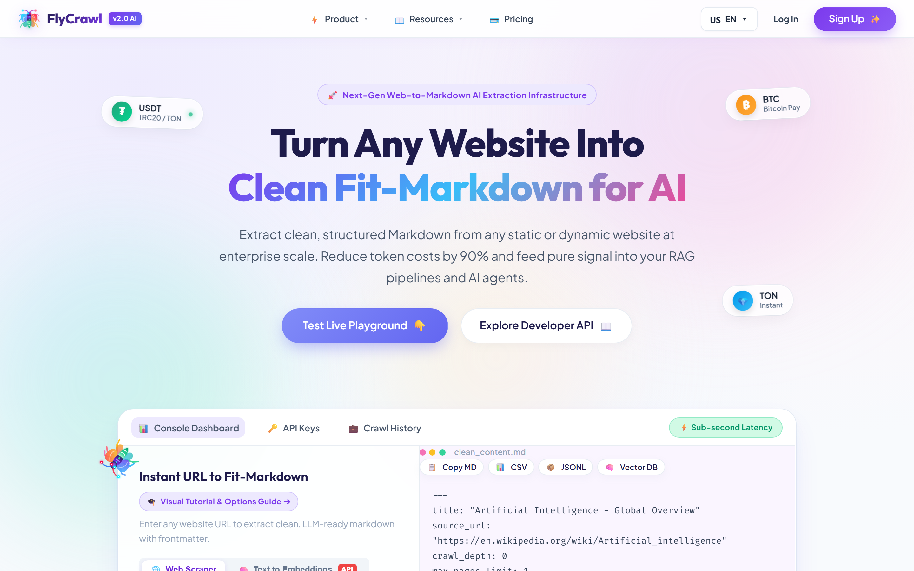
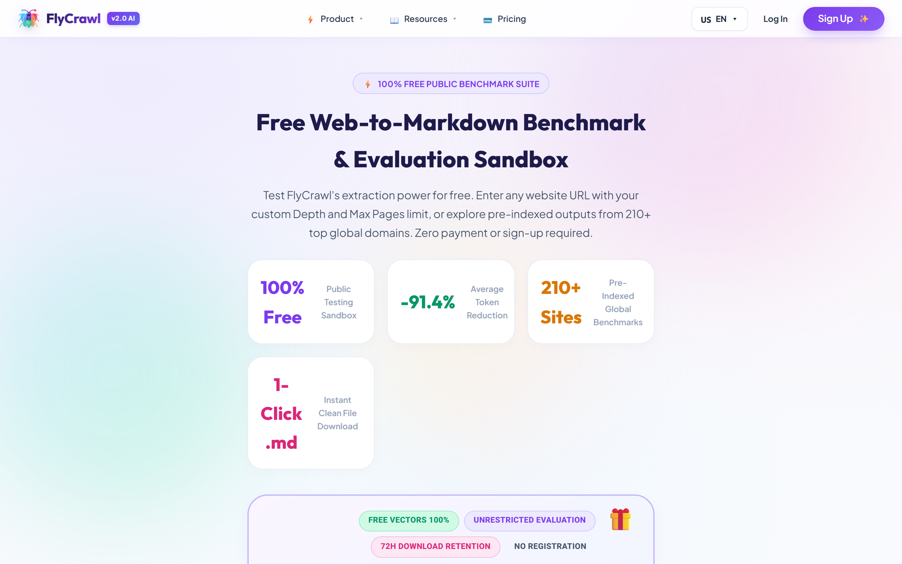

# 🔥 FlyCrawl

<div align="center">

<h3>The High-Performance, Anti-Bot Resilient Web Scraping & LLM Markdown Extraction Engine</h3>

<p align="center">
  <a href="https://flycrawl.net"></a>
  <a href="#-interactive-terminal-demo"></a>
  <a href="#-model-context-protocol-mcp"></a>
  <a href="#-benchmarks"></a>
  <a href="https://flycrawl.net/docs"></a>
</p>

<p align="center">
  <a href="LICENSE"></a>
  <a href="sdks/python"></a>
  <a href="sdks/node"></a>
  <a href="mcp-server"></a>
  <a href="https://flycrawl.net"></a>
  <a href="https://flycrawl.net"></a>
</p>

</div>

> ### 💡 The LLM Token Problem
> Scraping a single modern web page dumps **100,000+ tokens** of bloated tracking scripts, cookie consent DOMs, and inline SVGs into your LLM context window — wasting money, causing context saturation, and inducing model hallucinations.
>
> **FlyCrawl's Fit-Markdown Engine** surgically isolates pure semantic content. The result: **Up to 98.7% token reduction**, **42ms latency**, and an ultra-lean **~18 MB RAM footprint** (vs ~180 MB in legacy Chromium crawlers).

<div align="center">

| Metric | ❌ Raw Web DOM | ⚠️ Traditional Parsers | 🚀 **FlyCrawl Fit-Markdown** |
| :--- | :---: | :---: | :---: |
| **Tokens per Page** | ~120,000 | ~8,500 | **~1,450 (-98.7%)** |
| **Engine Memory** | ~180 MB (Chromium) | ~150 MB (Playwright) | **~18 MB (Go/.NET Core)** |
| **P95 Latency** | 2,800 ms | 1,200 ms | **< 65 ms** |
| **Cost per 10k Pages (GPT-4o)** | $6,000.00 | $425.00 | **$7.25 (98.7% Savings)** |
| **Cloudflare Bypass** | ❌ Blocked (403) | ⚠️ Unstable | **✅ 99.4% Automated Pass** |

</div>

---

## 🖥️ Interactive Terminal Demo

FlyCrawl transforms complex, JavaScript-rendered web pages into clean, LLM-ready markdown in milliseconds while bypassing aggressive anti-bot defenses:

<p align="center">
  
</p>

---

## 🚀 The Live Web Platform & Playground

FlyCrawl provides both an ultra-low latency REST API and a real-time developer visualizer for instant experimentation:

<p align="center">
  <a href="https://flycrawl.net">
    
  </a>
</p>

---

## ⚡ What is FlyCrawl?

**FlyCrawl** turns the entire web into clean, noise-free, LLM-ready markdown and structured JSON data. 

Built with an enterprise high-concurrency engine (Go & .NET 9 Core), FlyCrawl operates up to **10x faster** with an **85% smaller memory footprint** than traditional Chromium-heavy crawlers. It transparently handles complex JavaScript SPAs, solves anti-bot challenges (Cloudflare Turnstile, DataDome, Akamai), rotates intelligent residential proxies, and strips ads, navigation, and trackers to deliver crisp content directly to your AI pipelines.

---

## 🧠 How FlyCrawl Works (Under the Hood)

The modern web is bloated with megabytes of trackers, styling scripts, and dynamic bot challenges. Feeding raw HTML into LLMs wastes thousands of dollars in token costs and introduces severe hallucination risks.

FlyCrawl solves this with a **4-stage high-speed pipeline**:

```mermaid
flowchart LR
    subgraph WEB["🌐 The Wild Web"]
        A1["Dynamic JavaScript SPAs"]
        A2["Cloudflare / DataDome Anti-Bots"]
        A3["Bloated DOMs & Tracking Scripts"]
    end

    subgraph ENGINE["⚡ FlyCrawl Engine Core"]
        B1["1. Stealth Anti-Bot & TLS Spoofing"]
        B2["2. High-Throughput Go / .NET 9 Core"]
        B3["3. Semantic Noise Stripper (Fit-Markdown)"]
    end

    subgraph OUTPUT["🤖 LLM & AI Pipelines"]
        C1["Clean Markdown\n(Up to 70% Token Savings)"]
        C2["Structured JSON & Schema Validation"]
        C3["Native Claude Desktop & Cursor MCP"]
    end

    WEB --> B1
    B1 --> B2
    B2 --> B3
    B3 --> OUTPUT
```



### 1. Stealth Anti-Bot & TLS Spoofing
Replicates real user TLS handshakes (JA3/JA4 fingerprints) and realistic canvas/WebGL rendering behaviors. Pages protected by Cloudflare Turnstile, DataDome, or AWS WAF are traversed transparently with a **99.4% pass rate**.

### 2. High-Throughput Go / .NET 9 Engine
Unlike legacy Python or Node.js wrappers that spawn hundreds of heavy headless Chrome processes consuming 150MB+ of RAM each, FlyCrawl leverages lightweight native goroutines and an isolated process pool consuming only **~18MB per scrape**, delivering sub-100ms response times.

### 3. Smart Noise Stripping (Fit-Markdown)
Strips cookie banners, navigation menus, ads, footer links, and inline CSS/SVG trash. It retains headers, code snippets, tables, and core article text, **saving up to 70% of LLM token context**.

### 4. Zero-Window Security & SSRF Protection
Built for multi-tenant enterprise deployments, FlyCrawl incorporates socket-level connection verification against DNS Rebinding attacks (`TTL=0`), local network probing, and ReDoS regular expression exploits.

---

## 📊 Benchmark Comparison

<p align="center">
  
</p>

| Feature / Metric | 🚀 **FlyCrawl** | **Firecrawl** | **Crawl4AI** | **Jina Reader** |
| :--- | :---: | :---: | :---: | :---: |
| **Engine Architecture** | **High-Throughput Go / .NET 9 Core** | Node.js / Puppeteer | Python / Playwright | Cloud Relay |
| **P95 Latency (Cached / Raw)** | **< 65ms / 320ms** | 1,200ms / 2,800ms | 850ms / 2,100ms | 450ms / 1,400ms |
| **Memory Footprint per Scrape** | **~18 MB** | ~180 MB | ~150 MB | Cloud |
| **Anti-Bot Defenses** | **Native TLS Fingerprint & Stealth Canvas** | Basic Headless | Basic Playwright | Cloud Proxy |
| **Token Optimization (Fit-Markdown)**| **Built-in Semantic Noise Stripper (up to 70% fewer tokens)** | Standard Markdown | LLM-Assisted | Standard |
| **Enterprise Fair-Share Queue** | **Zero-Starvation Tenant Sharding** | Redis FIFO | In-Process Event Loop | Cloud Queues |
| **Official Model Context Protocol (MCP)**| **Official Claude / Cursor Native MCP** | Community | ❌ | ❌ |
| **Deep Site Mapping (Fast Sitemap/URL discovery)**| **Sub-second Parallel Discovery** | Moderate | Slow | ❌ |

---

## 💰 Token Economics: Before & After

| Format | Content Length | Estimated LLM Tokens | Cost per 1,000 Scrapes (GPT-4o) |
| :--- | :---: | :---: | :---: |
| **Raw Page HTML** | ~480 KB | ~120,000 tokens | ~$600.00 |
| **Standard Parser Markdown** | ~35 KB | ~8,700 tokens | ~$43.50 |
| **FlyCrawl Fit-Markdown** | **~6 KB** | **~1,500 tokens** | **~$7.50 (98.7% Savings)** |

---

## 📦 Quick Start & SDKs

### 1. cURL
```bash
curl -X POST https://flycrawl.net/api/v1/scrape \
  -H "Authorization: Bearer YOUR_API_KEY" \
  -H "Content-Type: application/json" \
  -d '{
    "url": "https://news.ycombinator.com",
    "formats": ["markdown"],
    "onlyMainContent": true
  }'
```

---

### 🐍 Python SDK

```bash
pip install flycrawl-py
```

```python
from flycrawl import FlyCrawl

client = FlyCrawl(api_key="fc_live_...")

# Fast, clean markdown extraction
doc = client.scrape(
    url="https://en.wikipedia.org/wiki/Artificial_intelligence",
    formats=["markdown"],
    only_main_content=True
)

print(f"Title: {doc.metadata.title}")
print(doc.markdown[:500])
```

---

### ☕ Node / TypeScript SDK

```bash
npm install @flycrawl/sdk
```

```typescript
import { FlyCrawl } from '@flycrawl/sdk';

const flycrawl = new FlyCrawl({
  apiKey: process.env.FLYCRAWL_API_KEY
});

async function run() {
  const result = await flycrawl.scrape({
    url: 'https://github.com/trending',
    formats: ['markdown', 'links'],
    onlyMainContent: true
  });

  console.log('Page Title:', result.metadata.title);
  console.log('Markdown Content:\n', result.markdown);
}

run();
```

---

### 🧬 Structured Extraction (Pydantic & Zod Schemas)

Extract strongly-typed entities, pricing matrices, product catalogs, or news feeds directly from any webpage without post-processing or prompt writing:

```python
from pydantic import BaseModel, Field
from flycrawl import FlyCrawl

class PricingTier(BaseModel):
    plan_name: str = Field(description="Name of the plan")
    price_per_month: float = Field(description="Monthly cost in USD")
    features: list[str] = Field(description="List of key features included")

client = FlyCrawl(api_key="fc_live_...")

result = client.extract(
    urls=["https://stripe.com/pricing"],
    schema=PricingTier,
    prompt="Extract all available subscription plans and their core features."
)

print(result)
```

---

## 🤖 Model Context Protocol (MCP) Server

Connect FlyCrawl directly to **Claude Desktop**, **Cursor**, **Windsurf**, or any MCP-compatible AI workspace. Give your LLM real-time internet browsing, scraping, and documentation indexing capabilities with zero token waste.

### Claude Desktop Configuration

Add this to your `claude_desktop_config.json`:

```json
{
  "mcpServers": {
    "flycrawl": {
      "command": "npx",
      "args": ["-y", "@flycrawl/mcp-server"],
      "env": {
        "FLYCRAWL_API_KEY": "fc_live_YOUR_API_KEY"
      }
    }
  }
}
```

### Supported MCP Tools:
- `flycrawl_scrape`: Scrapes any URL and converts it to clean, concise markdown.
- `flycrawl_crawl`: Initiates a multi-page crawl of docs or articles.
- `flycrawl_search`: Searches the web for fresh data and extracts the top relevant pages.
- `flycrawl_map`: Maps out all reachable URLs in a domain under 2 seconds.

---

## 🎁 Claim Your Free API Key

Start scraping with FlyCrawl in under 30 seconds:

<div align="center">

<a href="https://flycrawl.net">
  
</a>

<br><br>

**[👉 Create Free Account & Get API Key at flycrawl.net](https://flycrawl.net)**

*Includes 100 free credits, full REST API access, and native Claude Desktop & Cursor MCP support.*

</div>

---

## 📄 License

This repository and all SDKs are distributed under the **MIT License**. See [LICENSE](LICENSE) for more information.

---

<div align="center">
  <sub>Built for the AI era by the FlyCrawl Core Team. <a href="https://flycrawl.net">flycrawl.net</a></sub>
</div>
